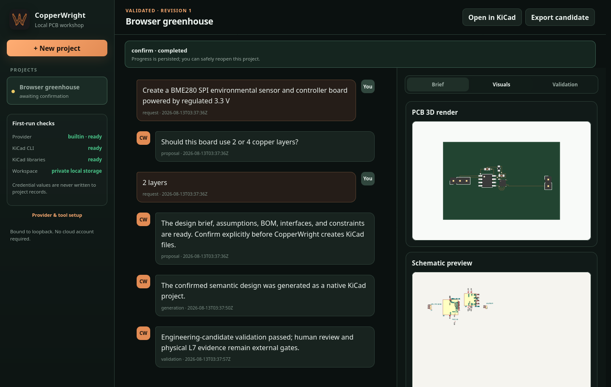

<p align="center">
  
</p>

<h1 align="center">CopperWright</h1>

<p align="center">
  <a href="README.md">English</a> ·
  <a href="README.zh-CN.md">简体中文</a> ·
  <a href="README.ja.md">日本語</a> ·
  <a href="README.ko.md">한국어</a>
</p>

<p align="center"><strong>対話から PCB を設計し、決定論的な KiCad 工程で仕上げます。</strong></p>

CopperWright はローカルファーストの Apache-2.0 アプリケーションです。会話から、
レビュー可能・検証可能・可逆な KiCad プロジェクトを作成します。ガイド付きの
ターミナル作業は `copperwright chat`、ループバックだけで動くブラウザ作業台は
`copperwright app` で開始できます。回路図/PCB、ジオメトリ、ルールチェック、
製造バックエンドは引き続き KiCad が担当します。AI は意図を解釈できますが、
部品、トポロジ、配置、配線、出力、検証、リリース ID は決定論的な
CopperWright コードが管理します。

範囲を限定した v1 は、実配線済みの三つの設計をサポートします：
ATtiny402/TMP102 I2C、ATtiny402/BME280 SPI、AP2112K 3.3 V LDO を備えた
5 V 入力の ATtiny402 UART コントローラです。いずれも、適用可能な実 KiCad
ERC/DRC と CopperWright の候補ゲートを通過します。ただし本番対応とは呼びません。
資格を持つ担当者によるレビュー、最新の調達情報、製造、立ち上げ、EMC、実測に
よる物理結果は外部ゲートです。

> **製品ステータス：**CopperWright 1.0.0 は、完成した範囲限定アプリケーション
> であり、汎用 PCB 自動設計ツールではありません。共通サービス、ターミナル/
> ブラウザの操作経路、永続化、セマンティック変更、三つのプロファイル、リリース
> 経路の実測結果は[製品受け入れ記録](docs/PRODUCT_ACCEPTANCE.md)にあります。
> 以前の [R01–R44 レポート](docs/FINAL_REPORT_ZH.md)は、歴史的なランタイム
> エビデンスとして変更せず保存しています。

## 実装済み機能

- `copperwright chat` と `copperwright app` が共有する唯一の権威あるアプリケーション
  サービス。非公開の永続プロジェクト、会話、判断、ジョブ、構造化イベント、再起動
  復旧、プロジェクト単位の同時実行ロックを管理します。
- 工学的な副作用の前に、焦点を絞った確認質問、読みやすい設計概要、仮定、BOM、
  インターフェース、制約、対応範囲の判断を示し、明示的な確認を求めます。
- レスポンシブでキーボード操作可能なローカルブラウザ UI。進捗/キャンセル/再試行、
  実際の回路図/PCB/3D プレビュー、成果物の直接パス、L0–L7 の検出事項、KiCad で
  開く操作、候補のエクスポートを備えます。
- 認証済みローカル Codex、環境変数で設定する OpenAI 互換、オフライン決定論的
  プロバイダをサポート。ブラウザはシークレットを受け取らず、会話にも保存しません。
- 対話型のセマンティック変更をプレビュー/適用/破棄/undo できます。ステージした
  設計が候補検証を通り、ユーザーが確認するまで現在の KiCad ファイルは変えません。
- 型付きインターフェース、電源ドメイン、要件、ブロック、制約、解析、リスク、
  来歴を含む厳密なセマンティック回路/PCB IR。
- 入力順序に依存しない決定論的な正規 JSON とコンテンツハッシュ。
- メーカー/MPN、ピン、シンボル、フットプリント、定格、ライフサイクル/情報源の
  エビデンス、調達状態、製造契約、利用可能なモデルを結び付ける CC0 の信頼済み
  部品グラフ。
- 宣言された部品、ポート、エビデンス、テスト参照を決定論的な実装と照合する、
  バージョン管理されルール検証済みの再利用可能ブロック。
- 事前条件、プレビュー、セマンティック diff、アトミックな公開、冪等性、
  競合検出、バックアップ、undo、クラッシュ復旧を備えたセマンティック変更セット。
- 要件コンパイル、範囲を限定した配置最適化、決定論的な多層 A* 配線、ファインピッチ
  引き出し配線、塗りつぶし参照プレーン、決定論的スティッチングビア、ネイティブ
  KiCad 生成。
- 認識済みフットプリントの位置・姿勢編集を対象とする双方向 KiCad 同期。
  トポロジ、部品、配線、回路図、ルールのドリフトはフェイルクローズします。
- L0–L7 の検証状態を正直に報告：`completed`、`not_applicable`、`unavailable`、
  `heuristic`、`human_required`。
- 実際の KiCad ERC/DRC、回路図整合性、BOM、配置、Gerber、ドリル、IPC-D-356、
  ボード統計、PDF、SVG、レンダリング、ボードのみの STEP を統合。
- バイト単位で再現可能なコンテンツリリース。元のハッシュを監査レシートに残した
  タイムスタンプ正規化、決定論的 ZIP、オフライン検証ツール。
- バージョン管理された CLI、Python API、上限付き改行区切り JSON-RPC 2.0 API。
- 検出、誤検出、修復、回帰、再現性、レイテンシ、任意のブラインド化モデル指標を
  測定する、90 ケースの独立した CC0 エラー注入コーパス。
- 従来のレビュー/安全パッチワークフローも非管理プロジェクト向けに利用可能です。
  ただし生テキスト置換はレガシー互換パスであり、主要な変更モデルではありません。

要件、実装、テストの対応は[仕様トレーサビリティ](docs/SPEC_TRACEABILITY.md)を
参照してください。製品の正確な検証結果と残りのゲートは
[v1 中国語レポート](docs/PRODUCT_REPORT_ZH.md)に記録し、歴史的ランタイム
レポートは変更せず保存しています。

## サポート範囲

同梱プロファイルは、意図的に狭く明確な範囲に限定しています。

| 契約 | 現在のサポート |
|---|---|
| I2C | `low_voltage_i2c_controller_v1`：安定化 3.3 V 入力、ATtiny402、TMP102、Qwiic、UPDI、LED |
| SPI | `low_voltage_spi_environment_v1`：安定化 3.3 V 入力、ATtiny402、基板上 BME280、4 線 SPI mode 0、1 MHz、UPDI |
| UART/LDO | `low_voltage_uart_ldo_controller_v1`：安定化 5 V 入力、AP2112K 3.3 V LDO、ATtiny402、3.3 V CMOS UART、UPDI、LED |
| 銅箔スタックアップ | 2 層または 4 層 |
| ボード外形 | 45 mm × 30 mm |
| 用途 | プロトタイプ、または安全性が重要でない低電圧センシング/制御 |
| KiCad | メジャー 10、厳密な受け入れテストは 10.0.5 |
| Python | 3.11+ |

USB 2.0 と buck 変換は認識されますが、v1 にはローカルで完全に検証された電気/
レイアウトの一連の契約がないため未対応です。RS-232 電圧は、対応する 3.3 V
CMOS UART ではありません。固定された検証済みの配置/配線契約に、別のボード
寸法を黙って適用することもありません。DDR、PCIe、SerDes、RF、商用電源、高電力、医療、
航空、安全性が重要な用途は、黙って近似せず明示的に拒否します。

テスト環境では、KiCad 10 Python API で生成した奇数の 3 銅層ボードを KiCad
自身が再読み込みできません。そのためネイティブ契約では、解析対象である 2–4 層
のうち一般的な 2/4 層のサブセットを採用しています。

## 要件

- Linux と `uv`
- Python 3.11 以降
- KiCad 10.x CLI、シンボル、フットプリント、システムの `pcbnew` Python バインディング
- 診断と開発に使用する Git
- 任意：対話型の意図解釈、`review`、レガシー `patch`、ライブモデル整合性
  ベンチマークに使用する認証済み Codex CLI
- 任意：`COPPERWRIGHT_OPENAI_BASE_URL`、`COPPERWRIGHT_OPENAI_MODEL`、API キーの
  環境変数だけで設定する OpenAI 互換 Chat Completions エンドポイント

ローカルで厳密に受け入れ確認したバージョンは KiCad 10.0.5 です。他の 10.x
バージョンは同じメジャーとして報告しますが、厳密なテスト済みとは扱いません。
他のメジャーはフェイルクローズします。Ubuntu では KiCad 公式の
`ppa:kicad/kicad-10.0-releases` 手順を利用できます。

## インストール

リポジトリのチェックアウトからインストールする場合：

```bash
scripts/deploy.sh
scripts/prepare-kicad-environment.sh
uv run copperwright doctor --json
```

ビルド済み wheel から隔離環境へインストールする場合：

```bash
uv build
uv venv /tmp/copperwright-venv
uv pip install --python /tmp/copperwright-venv/bin/python dist/*.whl
/tmp/copperwright-venv/bin/copperwright --version
```

`doctor.ok` は決定論的コアが利用可能であることを示します。オフラインプロバイダ、
生成、検証、リリース、検証ツール、決定論的ベンチマークに有料または非公開の
認証情報は不要です。

## 対話型クイックスタート

ブラウザアプリケーションを起動します（設計上、ループバックのみで待ち受けます）：

```bash
copperwright app
# ブラウザが自動で開かない場合は http://127.0.0.1:8765 を開きます
```

プロジェクトを作成し、レイヤー数の質問に答え、設計概要/BOM/制約を確認してから
生成を承認します。次に「Change this board to 4 layers」と依頼すると、Apply を
選ぶ前に検証済みのセマンティック diff を確認できます。Undo は以前の権威ある
状態を正確に復元します。Export candidate は製造候補を作成し、オフライン検証も
行います。

SSH でも同じライフサイクルを利用できます：

```bash
copperwright chat
# /new Greenhouse sensor
# Describe: Create a BME280 SPI environmental sensor controller
# Reply: 2 layers
# /confirm
# Change this board to 4 layers
# /confirm
# /undo
# /release
```

スクリプトからは `--new`、`--project`、`--message`、`--yes`、`--undo`、
`--validate`、`--release`、`--list`、`--json` を使えます。詳しくは
`copperwright chat --help` を参照してください。



## プロバイダとシークレット

`--provider auto` は、インストール済みで認証済みの Codex CLI、設定済みの
OpenAI 互換エンドポイント、オフライン分類器の順に選択します。
`--provider codex`、`--provider openai-compatible`、`--provider builtin` で
明示的に指定することもできます。

```bash
# CopperWright の外で認証します。トークンはプロジェクトへコピーされません。
codex login
copperwright app --provider codex

# または OpenAI 互換エンドポイントを使います。プロジェクトファイルには書かないでください。
COPPERWRIGHT_OPENAI_BASE_URL=https://provider.example/v1 \
COPPERWRIGHT_OPENAI_MODEL=model-id \
OPENAI_API_KEY='<secret>' \
copperwright app --provider openai-compatible
```

ブラウザに認証情報の入力欄はありません。モデル出力は schema とサイズで制限し、
正規化とスコープ確認を行います。ユーザーの確認前に工学的な副作用を起こせません。
プロバイダロジックが部品を選択したり KiCad を編集したりすることもありません。

## 決定論的ランタイムのクイックスタート

すべての出力パスは新規作成専用です。新しいパスを使うか、以前の使い捨て出力を
自分で削除してください。

```bash
copperwright compile \
  examples/attiny_sensor_controller/requirements.json \
  --output /tmp/controller.pcbir.json --json

copperwright generate \
  examples/attiny_sensor_controller/requirements.json \
  /tmp/controller --json

copperwright inspect /tmp/controller --json
copperwright validate /tmp/controller --output /tmp/controller-validation --json
copperwright release /tmp/controller /tmp/controller-release --json
copperwright release-verify /tmp/controller-release --json
```

生成プロジェクトには、元の要件、セマンティック IR、ネイティブ
`.kicad_sch/.kicad_pcb/.kicad_pro`、隔離ワーカーのレシート、セマンティック
スナップショット、ネイティブなパッド端制約の測定値、配線/参照プレーンの
エビデンス、ハッシュマニフェストが含まれます。リリースには、相互確認済みの
製造ファイル、正規化された検証エビデンス、実行レシート、コンテンツマニフェスト、
決定論的 ZIP が含まれます。

コミット済みの参照出力：

- [`examples/product_profiles`](examples/product_profiles) — 現在の三つの v1
  プロファイルのネイティブプロジェクト、検証、プレビュー
- [`examples/attiny_sensor_controller`](examples/attiny_sensor_controller)
- [`artifacts/product-e2e`](artifacts/product-e2e) — clean-HOME のブラウザ/チャット
  製品フローのエビデンスとスクリーンショット
- [`artifacts/acceptance/release`](artifacts/acceptance/release)
- [`artifacts/acceptance/review`](artifacts/acceptance/review)
- [`artifacts/benchmark/benchmark-20260812.json`](artifacts/benchmark/benchmark-20260812.json)

## セマンティックトランザクション

Agent は型付きの `pcb-agent-change-set` を出力し、KiCad テキストを編集する
代わりにトランザクションコマンドを使用します。

```bash
copperwright semantic-preview design.pcbir.json change-set.json --output /tmp/tx
copperwright semantic-apply /tmp/tx
copperwright semantic-undo /tmp/tx
copperwright semantic-recover /tmp/tx
```

操作対象は要件、部品、ネット/エンドポイント、制約、ボードルール、メタデータです。
各操作には理由があり、フィールド単位の期待値も指定できます。ランタイムはベース
ハッシュを確認し、すべての操作をメモリ上で適用し、結果の IR を検証して
セマンティック diff を書き出してから、ステージングを作成します。公開時には
リソースロックの下で元データとステージ済みデータのハッシュを再確認します。

レビュー済みのネイティブ KiCad フットプリント移動を取り込むには：

```bash
copperwright sync /tmp/controller --json
copperwright sync /tmp/controller --apply --json
copperwright sync-undo /tmp/.pcb-agent-transactions/sync-...
```

取り込むのは位置・姿勢の変更だけです。未知のボードバイト列、フットプリント変更、
部品の追加/削除、配線、ネット割り当て、回路図変更、プロジェクトルール変更は、
失われることなく明示的に拒否されます。

## 検証とエビデンス

検証ラダーはチェック単位およびレベル単位で報告されます。

| レベル | ランタイムのエビデンス |
|---|---|
| L0 | マニフェスト/ハッシュの完全性、セマンティック解析、ネイティブ KiCad 解析 |
| L1 | 正規部品、ピン、フットプリント/パッド、接続性、回路図/PCB 整合性 |
| L2 | 実際の KiCad ERC および DRC レポート |
| L3 | インターフェース、デカップリング、プルアップ、電流、配置、配線、意図ルール |
| L4 | ライフサイクル/BOM/製造契約、DFM プロキシ、リリース相互確認、外部調達/基板製造業者エビデンス |
| L5 | 適用可能な決定論的 DC/電力チェック。エビデンスがなければ SI/PI/熱/EMI は利用不可 |
| L6 | 外部エビデンスとして取り込まれ、帰属情報を持つ資格者レビュー |
| L7 | 外部エビデンスとして取り込まれ、帰属情報を持つボードシリアル/テスト計画/結果成果物 |

候補準備完了には、ローカルで実装可能なすべてのブロッキングゲートを通過する
必要があります。本番準備完了には、有効な L4 の調達/基板製造業者情報、L6 レビュー、
L7 物理エビデンスも必要です。ランタイムは提供されたエビデンスをコピーして
ハッシュ化しますが、`externally_supplied_not_independently_verified` と
ラベル付けし、自ら署名することはありません。

I2C プロファイルは、バスを 200 pF、4.7 kOhm プルアップに制限し、外部
プルアップを禁止します。SPI プロファイルは基板上の一つの BME280 を 4 線
mode 0、1 MHz に固定し、CS プルアップを検証します。UART/LDO プロファイルは
AP2112K の入出力、負荷、バイパス、安定性、イネーブルと、3.3 V CMOS 8-N-1
（RS-232 ではない）契約を検証します。デカップリング距離は対象となるネイティブ
銅パッド矩形間で測定し、すべての配線契約が塗りつぶし GND 参照プレーンと
決定論的 GND スティッチングビアを要求します。

管理プロジェクトのレビューには、厳密に解析された要件、IR、信頼済み部品/
ブロックレコード、生成レシート、ネイティブなセマンティックエクスポートが
渡されます。追跡対象ファイルにドリフトがあれば、それらの意図レコードを黙って
使用せず、非権威としてラベル付けします。モデル応答はあくまでヒューリスティック
レビューであり、L6 を満たすことはできません。

## CLI と Agent API

正式な CLI 仕様は `copperwright --help` と
`copperwright COMMAND --help` で確認できます。主なコマンドグループ：

- 製品：`chat`、`app`
- 設計：`compile`、`generate`、`inspect`、`parts`
- 検証/リリース：`validate`、`release`、`release-verify`、`evidence-record`
- 同期/トランザクション：`sync`、`sync-undo`、`sync-recover`、
  `semantic-preview`、`semantic-apply`、`semantic-undo`、`semantic-recover`
- 評価：`benchmark`
- 非管理プロジェクト互換：`review`、`patch`、`apply`
- 自動化：`api`

API は stdin から 1 行につき一つの JSON-RPC リクエストを読み、stdout へ
1 行につき一つのレスポンスを書き込みます。まず `runtime.capabilities` を
使用してください。これはサポート範囲とメソッドを示す機械可読の情報源です。

```bash
printf '%s\n' \
  '{"jsonrpc":"2.0","id":1,"method":"runtime.capabilities","params":{}}' \
  | copperwright api
```

プロセスが受け付けるのは最大 10,000 リクエスト、各リクエストは最大 4 MiB
です。パラメータセットは厳密で、パスと数値境界を検証し、プロトコルエラーでも
JSON-RPC フレーミングを維持します。[API リファレンス](docs/API.md)も参照して
ください。

## ベンチマーク

モデルやネットワークを使わずに決定論的コーパスを実行できます。

```bash
scripts/benchmark.sh
# or
copperwright benchmark /tmp/copperwright-benchmark.json --repetitions 5 --json
```

明示的に要求したライブモデル整合性テストでは、ブラインド化して隔離した反復を
2 回以上実行します。

```bash
MODEL_RUNS=2 scripts/benchmark.sh
```

現在の測定結果と制約は [BENCHMARK.md](BENCHMARK.md) にあります。このベンチマーク
は回帰コーパスであり、すべての PCB 障害を網羅するという主張ではありません。

## 互換名

配布パッケージと主要コマンドは `copperwright` です。インストールされる
`pcb-agent` コマンドは、同等の互換エイリアスとして残します。リスクがあるだけで
価値のないモジュール移行を避けるため、内部 Python モジュールも `pcb_agent`
のままです。

安定したディスク上およびプロトコル上の識別子も変更しません。これには
`pcb-agent-*` schema、`project.pcb-agent.json`、`.pcb-agent-*`
トランザクション/ロックディレクトリ、`PCB_AGENT_*` テスト/設定名前空間が
含まれます。名称変更前に作成されコミットされたエンジニアリングレシートと
ベンチマーク成果物には、記録どおり `pcb-agent-runtime` を残します。
CopperWright は履歴エビデンスを新しく見せるために書き換えません。

## 開発とリリースのチェック

```bash
scripts/test.sh
scripts/smoke.sh                 # real KiCad demo; no model by default
scripts/compatibility.sh         # Python 3.11–3.14 core matrix
scripts/chat-e2e.sh              # scriptable terminal product journey
uv run python scripts/browser-e2e.py  # real Firefox journey and restart
uv run python scripts/generate-product-examples.py
scripts/release-check.sh         # full clean-install product/release hard gate
```

互換性のあるローカルツールチェーンが存在する場合、`scripts/test.sh` は実際の
KiCad テストを自動実行します。存在しない場合は `unittest` の skip として記録
します。CI の定義は
[`.github/workflows/ci.yml`](.github/workflows/ci.yml) にあります。コーパスと
プロファイルのコントリビューション規則は
[開発ガイド](docs/DEVELOPMENT.md)を参照してください。

## セキュリティモデル

プロジェクト内容、モデル出力、メタデータ、アーカイブ、ファイル名は信頼できない
入力として扱います。ランタイムは、厳密な schema、バイト数/メンバー数/深さの
上限、非有限数の拒否、非ログインサブプロセス、時間/出力上限、新規作成専用の
出力、正規パス、シンボリックリンク/ハードリンク/特殊ファイルの拒否、ファイル
マニフェスト、リソースロック、アトミック書き込み、書き込み後検証を使用します。

隔離された `pcbnew` ワーカーは、内部生成された上限付き JSON ジョブを受け取り、
システム Python を `-I` で実行します。プロジェクトコードを import することは
ありません。Codex レビューは読み取り専用ツールポリシーを使用し、プロジェクト
設定、hooks、multi-agent、ネットワーク、特権ツールを無効にして、プロンプトを
stdin で渡します。このポリシーは OS サンドボックスではありません。信頼できない
プロジェクトはコンテナ/VM で実行し、開示権限のあるデータだけを送信してください。
[SECURITY.md](SECURITY.md)も参照してください。

## ライセンス

ランタイムのソースとドキュメントは Apache-2.0 です。[LICENSE](LICENSE)を
参照してください。同梱の部品/ブロックカタログと独立ベンチマークデータは、
[`src/pcb_agent/data/LICENSE.md`](src/pcb_agent/data/LICENSE.md) に記載のとおり
CC0-1.0 です。生成されたサンプル設計では、KiCad ライブラリの
CC-BY-SA 4.0 design exception に基づいて公式 KiCad ライブラリ素材を使用します。
依存関係と帰属の注記は [NOTICE](NOTICE) にあります。
公開プロジェクトの限定的な調査と実際の再利用判断は
[`docs/OPEN_SOURCE_REUSE.md`](docs/OPEN_SOURCE_REUSE.md)に記録しています。
調査対象プロジェクトのコードやアセットはコピーしていません。

保証やエンジニアリング認証は提供しません。製品、法域、リスクに応じた適格な
レビューを必ず実施してください。
